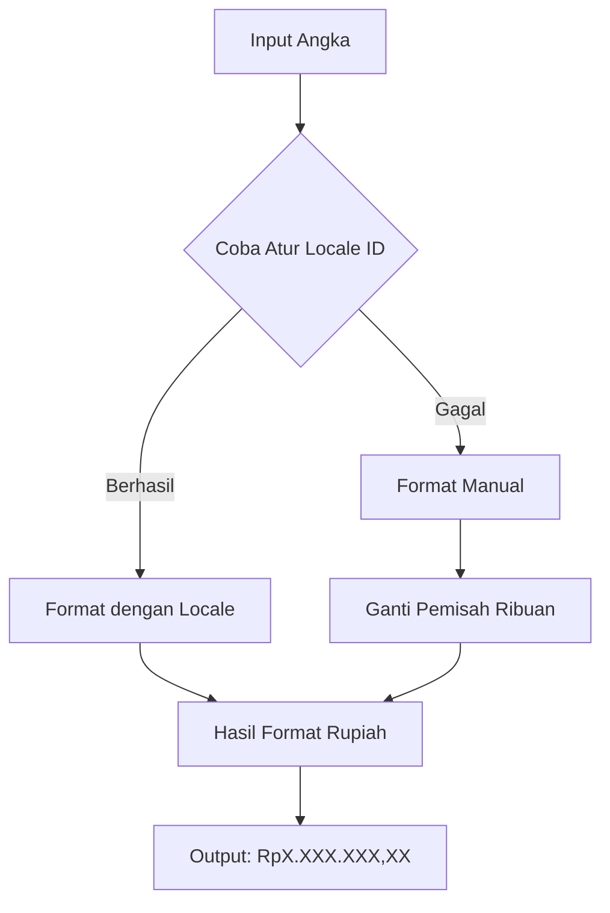

# Penjelasan Kode Format Rupiah

Mari kita bahas fungsi `format_rupiah` secara detail dengan bahasa yang mudah dipahami:

## 🎯 Tujuan Fungsi
Fungsi ini mengubah angka biasa menjadi format mata uang Rupiah Indonesia. Misalnya:
- Input: `1000000`
- Output: `"Rp1.000.000,00"`

## 📝 Analisis Baris per Baris

### 1. Definisi Fungsi
```python
def format_rupiah(value):
    """Formats a number into Indonesian Rupiah currency format (RpX.XXX.XXX,XX)."""
```
Seperti resep masak, ini adalah judul resepnya. Fungsi menerima satu bahan (`value`) dan akan mengolahnya.

### 2. Blok Try Utama
```python
try:
```
Ini seperti pengaman - "Mari kita coba, tapi hati-hati kalau ada kesalahan".

### 3. Pengaturan Locale Indonesia
```python
try:
    locale.setlocale(locale.LC_ALL, 'id_ID.UTF-8')
```
Ini seperti mengatur "bahasa" komputer ke Indonesia. Bayangkan seperti mengganti keyboard dari QWERTY ke DVORAK.

### 4. Penanganan Jika Locale Gagal
```python
except locale.Error:
    formatted_string = f"{float(value):,.2f}"
    int_part, dec_part = formatted_string.split('.')
    int_part_id = int_part.replace(',', '.')
    return f"Rp{int_part_id},{dec_part}"
```
Jika pengaturan "bahasa" gagal, kita pakai cara manual:
1. Format angka dengan pemisah ribuan koma (3,000,000.00)
2. Pisahkan bagian bulat dan desimal
3. Ganti koma dengan titik untuk gaya Indonesia
4. Gabungkan dengan "Rp" di depan

### 5. Format dengan Locale
```python
return locale.format_string("Rp%.2f", float(value), grouping=True)
```
Jika pengaturan "bahasa" berhasil, gunakan cara otomatis untuk format Rupiah.

### 6. Penanganan Error
```python
except (ValueError, TypeError):
    return "Rp0,00"
```
Jika input tidak valid (misalnya huruf alih-alih angka), kembalikan "Rp0,00".

### 7. Pembersihan
```python
finally:
    try:
        locale.setlocale(locale.LC_ALL, '')
    except locale.Error:
        pass
```
Seperti membereskan dapur setelah masak - kembalikan pengaturan "bahasa" ke semula.

## 🎨 Visualisasi Proses


## 🎮 Contoh Penggunaan
```python
print(format_rupiah(1000000))  # Output: Rp1.000.000,00
print(format_rupiah("abc"))    # Output: Rp0,00
print(format_rupiah(1234.56))  # Output: Rp1.234,56
```

Fungsi ini seperti "mesin penerjemah" yang mengubah angka biasa menjadi format Rupiah yang mudah dibaca orang Indonesia! 🇮🇩