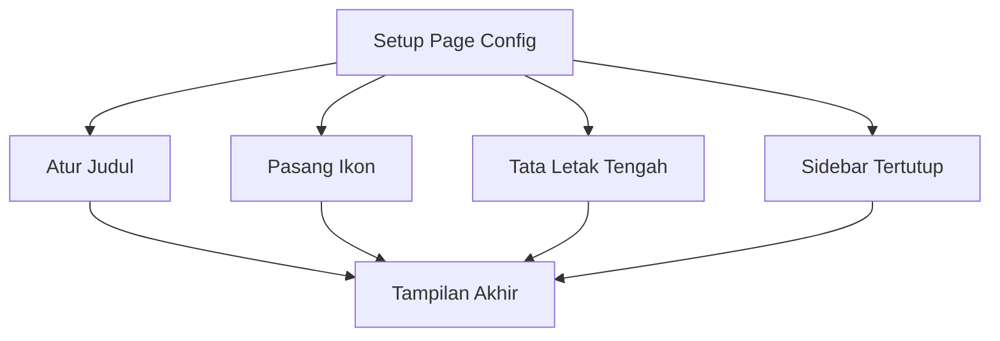

# Penjelasan Fungsi `setup_page_config()`

Mari kita bahas baris per baris dengan analogi yang mudah dipahami:

## 1. Definisi Fungsi
```python
def setup_page_config():
    """Configure the Streamlit page settings."""
```
**Analogi**: Ini seperti membuat daftar pengaturan untuk mendekorasi sebuah ruangan. Fungsi ini adalah "panduan dekorasi" untuk tampilan aplikasi web kita.

## 2. Pengaturan Halaman
```python
st.set_page_config(
```
**Analogi**: Ini seperti membuka formulir untuk mengisi detail dekorasi ruangan.

## 3. Parameter-parameter Konfigurasi:

### a. Judul Halaman
```python
    page_title="KISS - Versi 1.0.1",
```
**Analogi**: Seperti memasang papan nama di pintu ruangan. "KISS" adalah nama aplikasi (Kalkulator Insentif Sales Sederhana).

### b. Ikon Halaman
```python
    page_icon="💋",
```
**Analogi**: Seperti memasang logo kecil di samping papan nama. Menggunakan emoji "kiss" (💋) yang sesuai dengan nama KISS.

### c. Tata Letak
```python
    layout="centered",
```
**Analogi**: Seperti mengatur perabotan di tengah ruangan. "centered" berarti semua konten akan diatur di tengah halaman.

### d. Keadaan Sidebar
```python
    initial_sidebar_state="collapsed",
```
**Analogi**: Seperti mengatur pintu geser samping dalam keadaan tertutup saat pertama kali masuk.

## 🎨 Visualisasi


## 💡 Contoh Hasil
```
📊 Browser Tab
+-----------------+
| 💋 KISS - V1.0.1|  ← Judul & Ikon di tab browser
+-----------------+

📱 Tampilan Web
+------------------+
|                  |
|     Konten       | ← Konten ditengah
|     Utama        |
|                  |
+------------------+
```

Fungsi ini seperti "arsitek" yang mengatur tampilan dasar aplikasi web kita, memastikan semuanya tertata rapi dan profesional! 🏗️