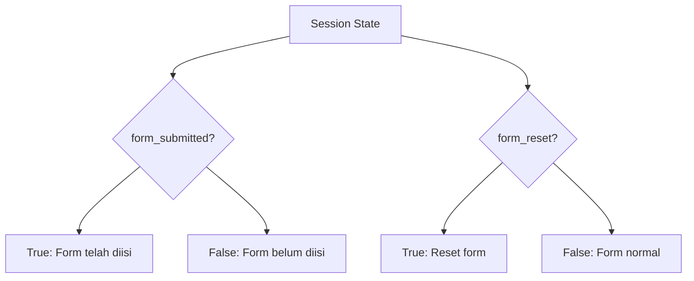

# Penjelasan Fungsi `initialize_session_state()`

Mari kita bahas fungsi ini dengan analogi yang mudah dipahami:

## 1. Definisi Fungsi
```python
def initialize_session_state():
    """Initialize session state variables if they don't exist."""
```
**Analogi**: Ini seperti menyiapkan buku catatan baru sebelum memulai pekerjaan.

## 2. Pengecekan Status Form
```python
if 'form_submitted' not in st.session_state:
    st.session_state.form_submitted = False
```
**Analogi**: Seperti membuat checkbox di buku catatan:
- ❌ `form_submitted = False` : "Belum mengisi formulir"
- ✅ `form_submitted = True` : "Sudah mengisi formulir"

## 3. Pengecekan Status Reset
```python
if 'form_reset' not in st.session_state:
    st.session_state.form_reset = False
```
**Analogi**: Seperti tombol reset di kalkulator:
- ❌ `form_reset = False` : "Kalkulator siap digunakan"
- ✅ `form_reset = True` : "Kalkulator perlu dikosongkan"

## 🎨 Visualisasi Status Form



## 📝 Contoh Penggunaan

```python
# Saat aplikasi pertama kali dibuka
print(st.session_state.form_submitted)  # False - Form belum diisi
print(st.session_state.form_reset)      # False - Form belum perlu direset

# Setelah user mengisi form
st.session_state.form_submitted = True   # Form sudah diisi

# Saat user menekan tombol reset
st.session_state.form_reset = True       # Form akan direset
st.session_state.form_submitted = False  # Status pengisian dikembalikan
```

## 🎯 Fungsi Dalam Konteks Aplikasi

Fungsi ini seperti "penjaga pintu" yang:
1. Memastikan aplikasi tahu apakah form sudah diisi atau belum
2. Mengatur kapan form perlu dikosongkan (reset)
3. Menjaga agar data tidak hilang saat halaman di-refresh

Bayangkan seperti pelayan restoran yang:
- Mengecek apakah meja sudah dipesan (form_submitted)
- Memastikan meja sudah dibersihkan untuk tamu berikutnya (form_reset)

Fungsi ini penting untuk memastikan aplikasi berjalan dengan lancar dan memberikan pengalaman yang baik bagi pengguna! 🌟