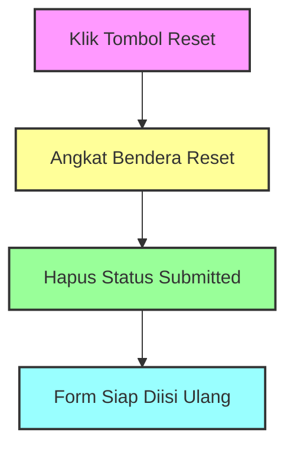

# Penjelasan Fungsi `reset_form_state()`

Mari kita bahas fungsi reset form ini dengan analogi yang mudah dipahami:

## 1. Definisi Fungsi
```python
def reset_form_state():
    """Set the reset flag to trigger form reset."""
```
**Analogi**: Seperti tombol "Reset" pada kalkulator. Ini adalah fungsi yang bertugas mengembalikan semua nilai ke kondisi awal.

## 2. Mengatur Flag Reset
```python
st.session_state.form_reset = True
```
**Analogi**: Seperti mengangkat bendera merah yang memberi tahu sistem "Hei, formulir perlu dibersihkan!". 
- Bayangkan seperti pelayan kafe yang mengangkat tanda "Meja Perlu Dibersihkan"

## 3. Mengatur Status Pengisian
```python
st.session_state.form_submitted = False
```
**Analogi**: Seperti menghapus tanda "✓" pada daftar "Formulir Sudah Diisi".
- Bayangkan seperti menghapus centang pada checklist pekerjaan

## 🎨 Visualisasi Proses



## 📝 Contoh Penggunaan Dalam Kehidupan Sehari-hari

Bayangkan seperti membersihkan meja makan:
1. `reset_form_state()` = Keputusan untuk membersihkan meja
2. `form_reset = True` = Memasang tanda "Meja Sedang Dibersihkan"
3. `form_submitted = False` = Menghapus tanda "Meja Sudah Terisi"

## 🔄 Alur Kerja
```
Sebelum Reset:
📝 Form = Terisi
✅ Submitted = True
❌ Reset = False

Setelah Reset:
📋 Form = Kosong
❌ Submitted = False
✅ Reset = True
```

Fungsi ini seperti "Tukang Bersih-bersih Digital" yang memastikan formulir siap digunakan kembali dengan kondisi yang bersih dan segar! 🧹✨