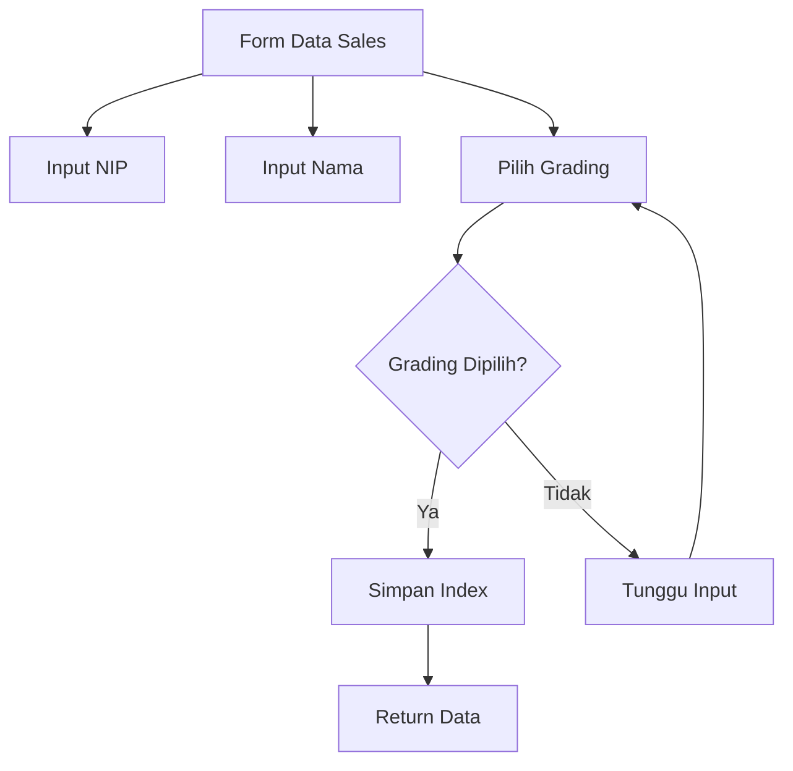

# Penjelasan Fungsi `show_sales_data_input()`

Mari kita bahas fungsi ini seperti sebuah formulir pendaftaran di resepsionis:

## 1. Judul Bagian
```python
def show_sales_data_input():
    """Display input fields for sales data."""
    st.subheader("Data Sales")
```
**Analogi**: Seperti papan nama di meja resepsionis bertuliskan "PENDAFTARAN"

## 2. Pengaturan Nilai Default
```python
# Default values based on reset state
nip_value = "" if st.session_state.form_reset else st.session_state.get("nip", "")
nama_value = "" if st.session_state.form_reset else st.session_state.get("nama", "")
grading_index = None if st.session_state.form_reset else st.session_state.get("grading_index", None)
```
**Analogi**: Seperti menyiapkan formulir kosong jika baru, atau mengambil formulir yang sudah terisi sebagian jika ada

## 3. Input Data Sales
```python
nip = st.text_input("NIP", value=nip_value, placeholder="Masukkan NIP sales", key="nip")
nama = st.text_input("Nama", value=nama_value, placeholder="Masukkan nama lengkap sales", key="nama")
```
**Analogi**: Seperti kolom isian di formulir:
- NIP: Nomor ID karyawan
- Nama: Nama lengkap karyawan

## 4. Pemilihan Grading
```python
grading = st.selectbox(
    "Grading",
    ("Trainee", "Junior", "Senior", "Executive"),
    index=grading_index,
    placeholder="Pilih grading bulan lalu",
    key="grading"
)
```
**Analogi**: Seperti memilih level jabatan dari daftar yang tersedia
- Seperti menu dropdown dengan 4 pilihan level karyawan

## 5. Penyimpanan Index Grading
```python
if grading is not None:
    grading_options = ("Trainee", "Junior", "Senior", "Executive")
    st.session_state.grading_index = grading_options.index(grading)
```
**Analogi**: Seperti mencatat nomor urut level jabatan di buku register

## 6. Pengembalian Data
```python
return nip, nama, grading
```
**Analogi**: Seperti menyerahkan formulir yang sudah diisi ke bagian selanjutnya

## 🎨 Visualisasi Form



## 📝 Contoh Penggunaan

```python
# Contoh data yang diinput:
NIP: "12345"
Nama: "John Doe"
Grading: "Senior"

# Yang tersimpan di session state:
st.session_state.nip = "12345"
st.session_state.nama = "John Doe"
st.session_state.grading = "Senior"
st.session_state.grading_index = 2  # karena Senior ada di index 2
```

## 🎯 Tampilan Form
```
+------------------------+
|      DATA SALES        |
+------------------------+
| NIP: [      12345     ]
| Nama: [    John Doe   ]
| Grading: [  Senior ▼  ]
+------------------------+
```

Fungsi ini seperti resepsionis digital yang membantu mengumpulkan informasi dasar tentang sales yang akan dihitung insentifnya! 📋✨