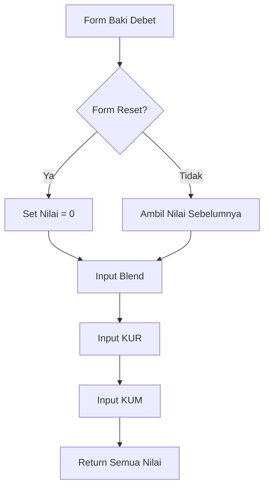

# Penjelasan Fungsi `show_baki_debet_input()`

Mari kita bahas fungsi ini seperti formulir input keuangan di bank:

## 1. Definisi Fungsi dan Judul
```python
def show_baki_debet_input():
    """Display input fields for baki debet data."""
    st.subheader("Baki Debet")
```
**Analogi**: Seperti membuat formulir khusus untuk mencatat sisa hutang nasabah.

## 2. Pengaturan Nilai Default
```python
default_value = 0 if st.session_state.form_reset else None
```
**Analogi**: Seperti menyiapkan formulir baru:
- Jika tombol reset ditekan → mulai dari 0
- Jika tidak → biarkan kosong

## 3. Input Baki Debet Blend Sebelumnya
```python
bade_blend_sebelumnya = st.number_input(
    "Bade Blend Bulan Sebelumnya",
    step=1,
    value=default_value if default_value is not None else st.session_state.get("bade_blend_sebelumnya", 0),
    placeholder="Masukkan baki debet blend bulan sebelumnya",
    key="bade_blend_sebelumnya"
)
```
**Analogi**: Seperti kolom untuk mencatat total hutang bulan lalu
- `step=1`: Bisa diisi per satuan
- `placeholder`: Petunjuk isian
- `key`: ID unik untuk kolom ini

## 4. Input Baki Debet KUR
```python
bade_kur = st.number_input(
    "Bade KUR",
    step=1,
    value=default_value if default_value is not None else st.session_state.get("bade_kur", 0),
    placeholder="Masukkan baki debet KUR",
    key="bade_kur"
)
```
**Analogi**: Seperti kolom khusus untuk mencatat sisa hutang KUR (Kredit Usaha Rakyat)

## 5. Input Baki Debet KUM
```python
bade_kum = st.number_input(
    "Bade KUM",
    step=1,
    value=default_value if default_value is not None else st.session_state.get("bade_kum", 0),
    placeholder="Masukkan baki debet KUM",
    key="bade_kum"
)
```
**Analogi**: Seperti kolom khusus untuk mencatat sisa hutang KUM (Kredit Usaha Mikro)

## 6. Pengembalian Nilai
```python
return bade_blend_sebelumnya, bade_kur, bade_kum
```
**Analogi**: Seperti menyerahkan formulir yang sudah diisi ke bagian selanjutnya

## 🎨 Visualisasi Form
```
+----------------------------------+
|          BAKI DEBET              |
+----------------------------------+
| Blend Bulan Lalu:  [   0    ▲▼]  |
| KUR:               [   0    ▲▼]  |
| KUM:               [   0    ▲▼]  |
+----------------------------------+
```

## 🔄 Alur Data


## 💡 Contoh Penggunaan
```python
# Contoh nilai yang diinput:
Bade Blend: 1.000.000.000
Bade KUR:     500.000.000
Bade KUM:     300.000.000

# Yang tersimpan di session state:
st.session_state.bade_blend_sebelumnya = 1000000000
st.session_state.bade_kur = 500000000
st.session_state.bade_kum = 300000000
```

Fungsi ini seperti "Teller Digital" yang membantu mencatat semua sisa hutang nasabah dengan rapi dan terstruktur! 💼📊