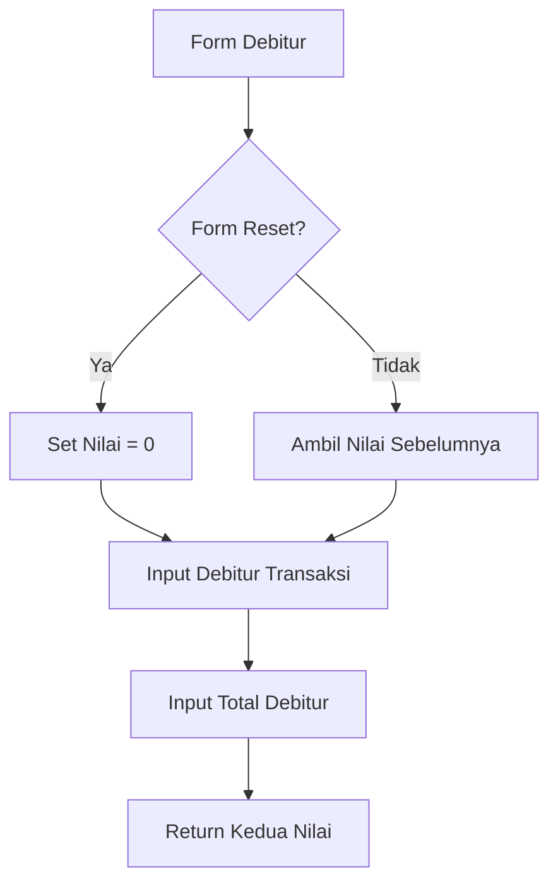

# Penjelasan Fungsi `show_debitur_trx_input()`

Mari kita bahas fungsi ini seperti sebuah formulir pencatatan transaksi nasabah:

## 1. Definisi Fungsi dan Judul
```python
def show_debitur_trx_input():
    """Display input fields for debitur transaksi data."""
    st.subheader("Jumlah Debitur Transaksi")
```
**Analogi**: Seperti membuat halaman baru di buku catatan dengan judul "CATATAN TRANSAKSI NASABAH"

## 2. Pengaturan Nilai Default
```python
default_value = 0 if st.session_state.form_reset else None
```
**Analogi**: Seperti menyiapkan pensil dan penghapus:
- Jika form direset → Mulai dari angka 0
- Jika tidak → Biarkan kosong

## 3. Input Debitur Transaksi
```python
debitur_trx = st.number_input(
    "Debitur Transaksi Perdagangan / Usak Genuine LVM",
    step=1,
    value=default_value if default_value is not None else st.session_state.get("debitur_trx", 0),
    placeholder="Masukkan jumlah debitur yang transaksi perdagangan / Usak genuine LVM",
    key="debitur_trx"
)
```
**Analogi**: Seperti kolom untuk mencatat jumlah nasabah yang aktif bertransaksi:
- `step=1`: Penambahan per 1 nasabah
- `placeholder`: Petunjuk pengisian
- `key`: ID unik untuk kolom ini

## 4. Input Total Debitur
```python
debitur_perdagangan = st.number_input(
    "Total Debitur Perdagangan",
    step=1,
    value=default_value if default_value is not None else st.session_state.get("debitur_perdagangan", 0),
    placeholder="Masukkan total debitur perdagangan",
    key="debitur_perdagangan"
)
```
**Analogi**: Seperti kolom untuk mencatat total seluruh nasabah:
- Mencatat semua nasabah, baik yang aktif maupun tidak

## 5. Pengembalian Nilai
```python
return debitur_trx, debitur_perdagangan
```
**Analogi**: Seperti menyerahkan laporan yang berisi dua angka penting

## 🎨 Visualisasi Form
```
+----------------------------------------+
|     JUMLAH DEBITUR TRANSAKSI           |
+----------------------------------------+
| Debitur Transaksi:                     |
| +------------------+                   |
| |     [ 0  ▲▼]     |                   |
| +------------------+                   |
|                                        |
| Total Debitur:                         |
| +------------------+                   |
| |     [ 0  ▲▼]     |                   |
| +------------------+                   |
+----------------------------------------+
```

## 🔄 Alur Data


## 💡 Contoh Penggunaan
```python
# Contoh input:
Debitur Transaksi: 25    # 25 nasabah aktif
Total Debitur: 50        # Total 50 nasabah

# Yang tersimpan:
st.session_state.debitur_trx = 25
st.session_state.debitur_perdagangan = 50

# Rasio aktivitas = 25/50 = 50% nasabah aktif
```

Fungsi ini seperti "Petugas Pencatat" yang menghitung berapa nasabah yang aktif dari total nasabah yang ada! 📊👥