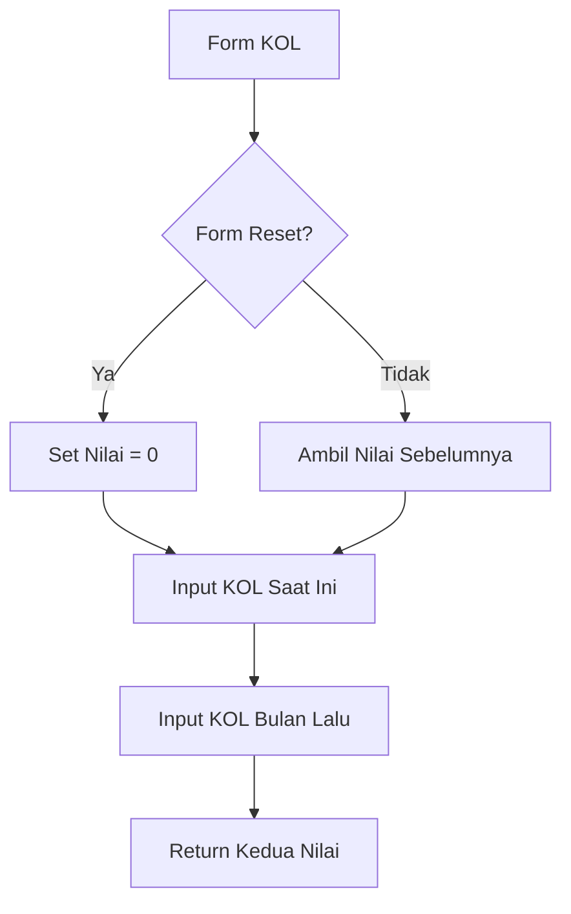

# Penjelasan Fungsi `show_kol_lancar_input()`

Mari kita bahas fungsi ini seperti formulir pencatatan kualitas kredit nasabah:

## 1. Definisi Fungsi dan Judul
```python
def show_kol_lancar_input():
    """Display input fields for KOL lancar data."""
    st.subheader("Bade Kol Lancar")
```
**Analogi**: Seperti membuat lembar penilaian kredit dengan judul "LAPORAN KREDIT LANCAR"

## 2. Pengaturan Nilai Default
```python
default_value = 0 if st.session_state.form_reset else None
```
**Analogi**: Seperti menyiapkan lembar kosong:
- Jika tombol reset ditekan → Mulai dari 0
- Jika tidak → Biarkan kosong untuk diisi

## 3. Input KOL 1 Saat Ini
```python
bade_kol1 = st.number_input(
    "Bade Kol 1",
    step=1,
    value=default_value if default_value is not None else st.session_state.get("bade_kol1", 0),
    placeholder="Masukkan total bade kol 1",
    key="bade_kol1"
)
```
**Analogi**: Seperti kolom untuk mencatat nilai kredit lancar saat ini:
- Seperti rapor kredit bulan ini
- `step=1`: Bisa diisi per satuan rupiah
- `placeholder`: Petunjuk pengisian

## 4. Input KOL 1 Bulan Lalu
```python
bade_kol1_bulan_sebelumnya = st.number_input(
    "Bade Kol 1 Bulan Sebelumnya",
    step=1,
    value=default_value if default_value is not None else st.session_state.get("bade_kol1_bulan_sebelumnya", 0),
    placeholder="Masukkan total bade kol 1 bulan sebelumnya",
    key="bade_kol1_bulan_sebelumnya"
)
```
**Analogi**: Seperti kolom untuk mencatat nilai kredit lancar bulan lalu:
- Untuk membandingkan performa kredit

## 5. Pengembalian Nilai
```python
return bade_kol1, bade_kol1_bulan_sebelumnya
```
**Analogi**: Seperti menyerahkan laporan perbandingan kredit lancar

## 🎨 Visualisasi Form
```
+----------------------------------------+
|          BADE KOL LANCAR               |
+----------------------------------------+
| Bade Kol 1 Saat Ini:                   |
| +------------------+                   |
| |     [ 0  ▲▼]     |                   |
| +------------------+                   |
|                                        |
| Bade Kol 1 Bulan Lalu:                 |
| +------------------+                   |
| |     [ 0  ▲▼]     |                   |
| +------------------+                   |
+----------------------------------------+
```

## 🔄 Alur Data


## 💡 Contoh Penggunaan
```python
# Contoh input:
KOL Saat Ini: 1.000.000.000    # Kredit lancar bulan ini
KOL Bulan Lalu: 950.000.000    # Kredit lancar bulan lalu

# Yang tersimpan:
st.session_state.bade_kol1 = 1000000000
st.session_state.bade_kol1_bulan_sebelumnya = 950000000

# Rasio perbaikan = 1.000.000.000/950.000.000 = 1.05 (meningkat 5%)
```

Fungsi ini seperti "Petugas Bank" yang mencatat dan membandingkan kualitas kredit nasabah dari waktu ke waktu! 📊💹