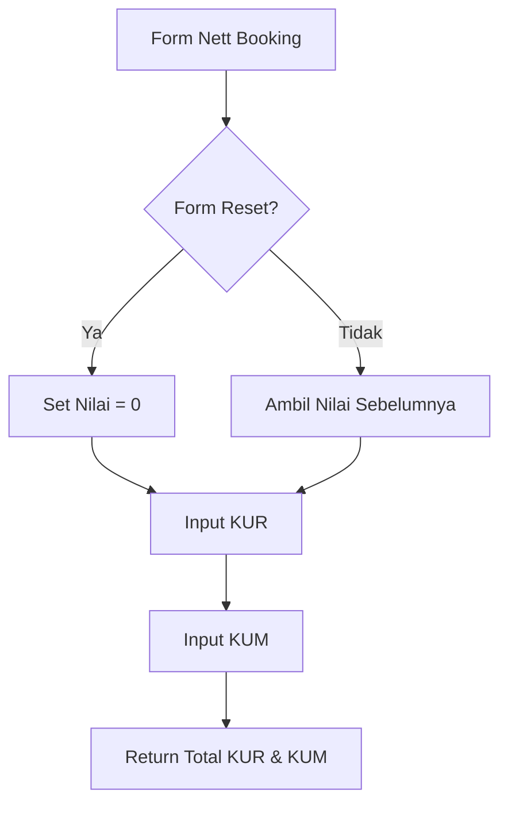

# Penjelasan Fungsi `show_nett_booking_input()`

Mari kita bahas fungsi ini seperti formulir pencatatan penjualan baru di bank:

## 1. Definisi Fungsi dan Judul
```python
def show_nett_booking_input():
    """Display input fields for nett booking data."""
    st.subheader("Nett Booking")
```
**Analogi**: Seperti membuat halaman baru dengan judul "LAPORAN PENJUALAN BERSIH"

## 2. Pengaturan Nilai Default
```python
default_value = 0 if st.session_state.form_reset else None
```
**Analogi**: Seperti menyiapkan kertas kosong:
- Jika form direset → Mulai dari angka 0
- Jika tidak → Biarkan kosong untuk diisi

## 3. Input Nett Booking KUR
```python
nett_booking_kur = st.number_input(
    "Nett Booking KUR",
    step=1,
    value=default_value if default_value is not None else st.session_state.get("nett_booking_kur", 0),
    placeholder="Masukkan total nett booking KUR",
    key="nett_booking_kur"
)
```
**Analogi**: Seperti kolom untuk mencatat penjualan kredit usaha rakyat (KUR):
- Seperti kasir menghitung uang masuk dari program KUR
- `step=1`: Bisa diisi per satuan rupiah
- `placeholder`: Petunjuk pengisian

## 4. Input Nett Booking KUM
```python
nett_booking_kum = st.number_input(
    "Nett Booking KUM",
    step=1,
    value=default_value if default_value is not None else st.session_state.get("nett_booking_kum", 0),
    placeholder="Masukkan total nett booking KUM",
    key="nett_booking_kum"
)
```
**Analogi**: Seperti kolom untuk mencatat penjualan kredit usaha mikro (KUM):
- Seperti kasir menghitung uang masuk dari program KUM

## 5. Pengembalian Nilai
```python
return nett_booking_kur, nett_booking_kum
```
**Analogi**: Seperti menyerahkan laporan total penjualan kedua jenis kredit

## 🎨 Visualisasi Form
```
+----------------------------------------+
|          NETT BOOKING                  |
+----------------------------------------+
| Nett Booking KUR:                      |
| +------------------+                   |
| |     [ 0  ▲▼]     |                   |
| +------------------+                   |
|                                        |
| Nett Booking KUM:                      |
| +------------------+                   |
| |     [ 0  ▲▼]     |                   |
| +------------------+                   |
+----------------------------------------+
```

## 🔄 Alur Data


## 💡 Contoh Penggunaan
```python
# Contoh input:
Nett Booking KUR: 500.000.000    # Penjualan KUR
Nett Booking KUM: 300.000.000    # Penjualan KUM

# Yang tersimpan:
st.session_state.nett_booking_kur = 500000000
st.session_state.nett_booking_kum = 300000000

# Total Booking = 800.000.000
```

Fungsi ini seperti "Kasir Bank" yang mencatat semua penjualan kredit baru, baik KUR maupun KUM! 💰📊