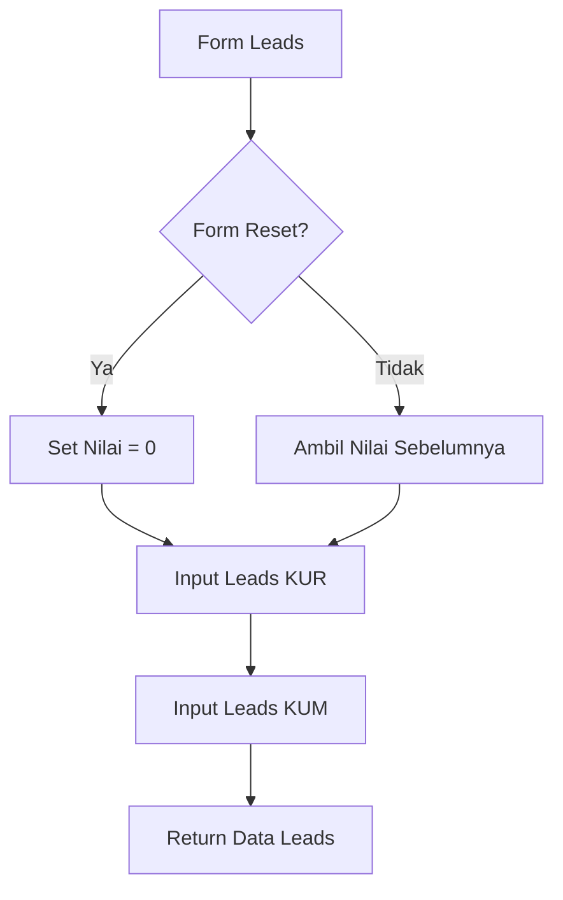

# Penjelasan Fungsi `show_leads_input()`

Mari kita bahas fungsi ini seperti formulir pencatatan calon nasabah potensial:

## 1. Definisi Fungsi dan Judul
```python
def show_leads_input():
    """Display input fields for leads data."""
    st.subheader("Leads")
```
**Analogi**: Seperti membuat halaman baru dengan judul "DATA CALON NASABAH"

## 2. Pengaturan Nilai Default
```python
default_value = 0 if st.session_state.form_reset else None
```
**Analogi**: Seperti menyiapkan formulir baru:
- Jika tombol reset ditekan → Mulai dari 0
- Jika tidak → Biarkan kosong

## 3. Input Leads KUR
```python
nett_booking_leads_kur = st.number_input(
    "Nett Booking Leads KUR",
    step=1,
    value=default_value if default_value is not None else st.session_state.get("nett_booking_leads_kur", 0),
    placeholder="Masukkan total nett booking leads KUR",
    key="nett_booking_leads_kur"
)
```
**Analogi**: Seperti mencatat jumlah penjualan dari referensi untuk kredit usaha rakyat:
- Mencatat berapa nasabah yang berhasil diprospek
- `step=1`: Penambahan per satu nasabah
- `placeholder`: Petunjuk pengisian

## 4. Input Leads KUM
```python
nett_booking_leads_kum = st.number_input(
    "Nett Booking Leads KUM",
    step=1,
    value=default_value if default_value is not None else st.session_state.get("nett_booking_leads_kum", 0),
    placeholder="Masukkan total nett booking leads KUM",
    key="nett_booking_leads_kum"
)
```
**Analogi**: Seperti mencatat jumlah penjualan dari referensi untuk kredit usaha mikro

## 5. Pengembalian Nilai
```python
return nett_booking_leads_kur, nett_booking_leads_kum
```
**Analogi**: Seperti menyerahkan laporan hasil prospek nasabah baru

## 🎨 Visualisasi Form
```
+----------------------------------------+
|              LEADS                     |
+----------------------------------------+
| Nett Booking Leads KUR:                |
| +------------------+                   |
| |     [ 0  ▲▼]     |                   |
| +------------------+                   |
|                                        |
| Nett Booking Leads KUM:                |
| +------------------+                   |
| |     [ 0  ▲▼]     |                   |
| +------------------+                   |
+----------------------------------------+
```

## 🔄 Alur Data


## 💡 Contoh Penggunaan
```python
# Contoh input:
Leads KUR: 5    # 5 nasabah baru dari referensi untuk KUR
Leads KUM: 3    # 3 nasabah baru dari referensi untuk KUM

# Yang tersimpan:
st.session_state.nett_booking_leads_kur = 5
st.session_state.nett_booking_leads_kum = 3

# Total leads = 8 nasabah baru dari referensi
```

Fungsi ini seperti "Marketing Intelligence" yang mencatat semua nasabah potensial yang didapat dari referensi! 🎯👥