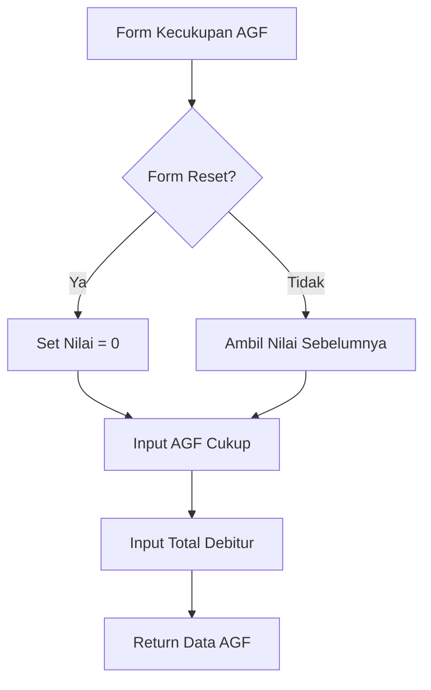

# Penjelasan Fungsi `show_kecukupan_agf_input()`

Mari kita bahas fungsi ini seperti formulir pemeriksaan kelengkapan dokumen nasabah:

## 1. Definisi Fungsi dan Judul
```python
def show_kecukupan_agf_input():
    """Display input fields for kecukupan AGF data."""
    st.subheader("Kecukupan AGF")
```
**Analogi**: Seperti membuat lembar checklist kelengkapan berkas dengan judul "PEMERIKSAAN BERKAS AGF"

## 2. Pengaturan Nilai Default
```python
default_value = 0 if st.session_state.form_reset else None
```
**Analogi**: Seperti menyiapkan formulir baru:
- Jika form direset → Mulai dari 0
- Jika tidak → Biarkan kosong

## 3. Input Debitur AGF Cukup
```python
agf_cukup_kol1 = st.number_input(
    "Debitur AGF Cukup Kol 1",
    step=1,
    value=default_value if default_value is not None else st.session_state.get("agf_cukup_kol1", 0),
    placeholder="Masukkan total debitur AGF cukup kol 1",
    key="agf_cukup_kol1"
)
```
**Analogi**: Seperti menghitung berkas nasabah yang lengkap:
- Mencatat jumlah nasabah yang berkasnya lengkap
- `step=1`: Penambahan per satu nasabah
- `placeholder`: Petunjuk pengisian

## 4. Input Total Debitur
```python
debitur_kol1 = st.number_input(
    "Total Debitur Kol 1",
    step=1,
    value=default_value if default_value is not None else st.session_state.get("debitur_kol1", 0),
    placeholder="Masukkan total debitur kol 1",
    key="debitur_kol1"
)
```
**Analogi**: Seperti mencatat total seluruh nasabah yang perlu diperiksa berkasnya

## 5. Pengembalian Nilai
```python
return agf_cukup_kol1, debitur_kol1
```
**Analogi**: Seperti melaporkan hasil pemeriksaan berkas:
- Berapa yang lengkap
- Berapa total yang diperiksa

## 🎨 Visualisasi Form
```
+----------------------------------------+
|          KECUKUPAN AGF                 |
+----------------------------------------+
| Debitur AGF Cukup:                     |
| +------------------+                   |
| |     [ 0  ▲▼]     |                   |
| +------------------+                   |
|                                        |
| Total Debitur:                         |
| +------------------+                   |
| |     [ 0  ▲▼]     |                   |
| +------------------+                   |
+----------------------------------------+
```

## 🔄 Alur Data


## 💡 Contoh Penggunaan
```python
# Contoh input:
AGF Cukup: 80    # 80 nasabah dengan berkas lengkap
Total Debitur: 100  # Total 100 nasabah

# Yang tersimpan:
st.session_state.agf_cukup_kol1 = 80
st.session_state.debitur_kol1 = 100

# Rasio kelengkapan = 80/100 = 80%
```

Fungsi ini seperti "Auditor Berkas" yang memastikan kelengkapan dokumen nasabah! 📋✔️