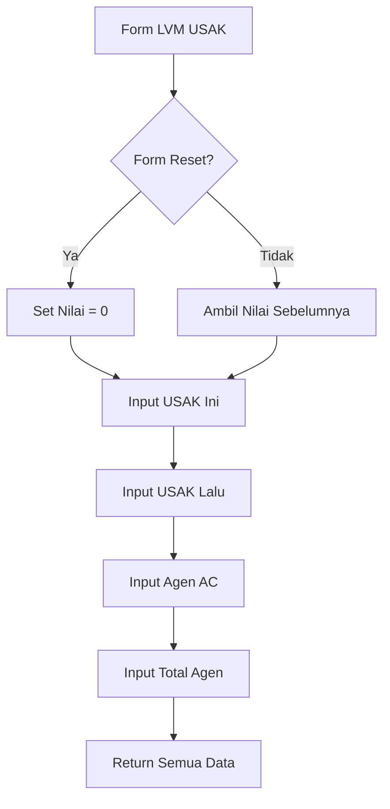

# Penjelasan Fungsi `show_lvm_usak_input()`

Mari kita bahas fungsi ini seperti formulir pencatatan kinerja agen penjualan:

## 1. Definisi Fungsi dan Judul
```python
def show_lvm_usak_input():
    """Display input fields for LVM USAK data."""
    st.subheader("LVM USAK Genuine & Agen")
```
**Analogi**: Seperti membuka halaman baru dengan judul "LAPORAN KINERJA AGEN & MITRA"

## 2. Pengaturan Nilai Default
```python
default_value = 0 if st.session_state.form_reset else None
```
**Analogi**: Seperti menyiapkan formulir baru:
- Jika reset ditekan → Mulai dari 0
- Jika tidak → Biarkan kosong

## 3. Input USAK Bulan Ini
```python
usak_bulan_ini = st.number_input(
    "USAK Genuine Bulan Ini",
    step=1,
    value=default_value if default_value is not None else st.session_state.get("usak_bulan_ini", 0),
    placeholder="Masukkan total usak genuine bulan ini",
    key="usak_bulan_ini"
)
```
**Analogi**: Seperti mencatat jumlah transaksi mitra resmi bulan ini

## 4. Input USAK Bulan Sebelumnya
```python
usak_bulan_sebelumnya = st.number_input(
    "USAK Genuine Bulan Sebelumnya",
    step=1,
    value=default_value if default_value is not None else st.session_state.get("usak_bulan_sebelumnya", 0),
    placeholder="Masukkan total usak genuine bulan sebelumnya",
    key="usak_bulan_sebelumnya"
)
```
**Analogi**: Seperti mencatat jumlah transaksi mitra resmi bulan lalu untuk perbandingan

## 5. Input Agen AC
```python
agen_ac = st.number_input(
    "Jumlah Agen AC",
    step=1,
    value=default_value if default_value is not None else st.session_state.get("agen_ac", 0),
    placeholder="Masukkan total agen AC",
    key="agen_ac"
)
```
**Analogi**: Seperti menghitung jumlah agen aktif berkinerja baik

## 6. Input Agen Kelolaan
```python
agen_kelolaan = st.number_input(
    "Jumlah Agen Kelolaan",
    step=1,
    value=default_value if default_value is not None else st.session_state.get("agen_kelolaan", 0),
    placeholder="Masukkan total agen kelolaan",
    key="agen_kelolaan"
)
```
**Analogi**: Seperti menghitung total seluruh agen yang dikelola

## 🎨 Visualisasi Form
```
+----------------------------------------+
|       LVM USAK GENUINE & AGEN          |
+----------------------------------------+
| USAK Bulan Ini:                        |
| +------------------+                   |
| |     [ 0  ▲▼]     |                   |
| +------------------+                   |
|                                        |
| USAK Bulan Lalu:                       |
| +------------------+                   |
| |     [ 0  ▲▼]     |                   |
| +------------------+                   |
|                                        |
| Jumlah Agen AC:                        |
| +------------------+                   |
| |     [ 0  ▲▼]     |                   |
| +------------------+                   |
|                                        |
| Total Agen:                            |
| +------------------+                   |
| |     [ 0  ▲▼]     |                   |
| +------------------+                   |
+----------------------------------------+
```

## 🔄 Alur Data


## 💡 Contoh Penggunaan
```python
# Contoh input:
USAK Bulan Ini: 100      # 100 transaksi
USAK Bulan Lalu: 80      # 80 transaksi
Agen AC: 15              # 15 agen berkinerja baik
Total Agen: 20           # Total 20 agen

# Analisis:
- Pertumbuhan USAK: 25% (100/80)
- Rasio Agen AC: 75% (15/20)
```

Fungsi ini seperti "Supervisor Agen" yang memantau kinerja dan perkembangan jaringan agen! 📊👥