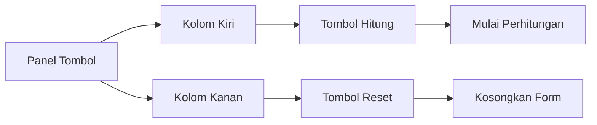

# Penjelasan Fungsi `show_action_buttons()`

Mari kita bahas fungsi ini seperti membuat panel tombol kontrol:

## 1. Definisi Fungsi
```python
def show_action_buttons():
    """Display calculate and reset buttons."""
```
**Analogi**: Seperti membuat kotak panel yang berisi tombol-tombol kendali

## 2. Pembagian Kolom
```python
col1, col2 = st.columns(2)
```
**Analogi**: Seperti membagi panel menjadi dua bagian sama lebar
- Seperti membuat dua laci di sebuah meja

## 3. Tombol Hitung
```python
with col1:
    calculate_button = st.button("💰 Hitung Insentif", type="primary", use_container_width=True)
```
**Analogi**: Seperti memasang tombol hijau besar di laci kiri
- `💰` = Ikon uang untuk visualisasi
- `type="primary"` = Warna utama (biasanya biru)
- `use_container_width=True` = Tombol memenuhi lebar laci

## 4. Tombol Reset
```python
with col2:
    reset_button = st.button("🔄 Reset Form", type="secondary", use_container_width=True, on_click=reset_form_state)
```
**Analogi**: Seperti memasang tombol abu-abu besar di laci kanan
- `🔄` = Ikon reset untuk visualisasi
- `type="secondary"` = Warna sekunder (biasanya abu-abu)
- `on_click=reset_form_state` = Ketika diklik, jalankan fungsi reset

## 5. Pengembalian Nilai
```python
return calculate_button, reset_button
```
**Analogi**: Seperti memberikan status kedua tombol (aktif/tidak) ke sistem

## 🎨 Visualisasi Panel Tombol
```
+---------------------------+
|   [💰 Hitung Insentif]   |   [🔄 Reset Form]   |
+---------------------------+
```

## 🔄 Alur Kerja


## 💡 Contoh Interaksi
```
1. Pengguna mengisi form ✍️
2. Pilihan aksi:
   - Klik 💰 Hitung Insentif → Mulai perhitungan
   - Klik 🔄 Reset Form → Kosongkan semua isian
```

Fungsi ini seperti "Panel Kontrol" yang memberikan pengguna pilihan untuk menghitung atau mengulang dari awal! 🎮