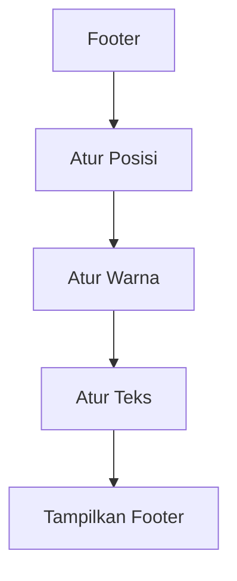

# Penjelasan Fungsi `show_footer()`

Mari kita bahas fungsi ini seperti membuat desain kartu nama di bagian bawah aplikasi:

## 1. Definisi Fungsi
```python
def show_footer():
    """Display application footer."""
    st.markdown(...)
```
**Analogi**: Seperti menyiapkan tempat untuk tanda tangan di bawah surat

## 2. Pengaturan Style CSS
```python
<style>
.footer {
    position: fixed;
    left: 0;
    bottom: 0;
    width: 100%;
    background-color: rgb(0, 61, 121);
    color: #fff;
    text-align: center;
    padding: 5px;
    font-size: 0.9em;
}
</style>
```
**Analogi**: Seperti mengatur tampilan kartu nama:
- `position: fixed` → Seperti menempel kartu nama dengan lem permanen
- `left: 0, bottom: 0` → Ditempel di pojok bawah
- `width: 100%` → Memanjang dari kiri ke kanan
- `background-color: rgb(0, 61, 121)` → Warna biru tua profesional
- `color: #fff` → Teks putih agar kontras
- `text-align: center` → Tulisan di tengah seperti kartu nama
- `padding: 5px` → Memberi ruang bernafas di sekitar teks
- `font-size: 0.9em` → Ukuran teks sedikit lebih kecil

## 3. Konten Footer
```python
<div class="footer">
    <p><b>©️ 2025 | 👨‍💻 OKI DWI YULIANTO</b></p>
</div>
```
**Analogi**: Seperti menulis identitas di kartu nama:
- `©️` → Simbol hak cipta
- `👨‍💻` → Emoji programmer
- Nama pengembang dalam format tebal

## 4. Pengaturan Keamanan
```python
unsafe_allow_html=True
```
**Analogi**: Seperti memberi izin untuk menggunakan tinta khusus (HTML) dalam kartu nama

## 🎨 Visualisasi Footer
```
+----------------------------------------+
|                                        |
|           [Konten Aplikasi]            |
|                                        |
+----------------------------------------+
|    ©️ 2025 | 👨‍💻 OKI DWI YULIANTO      |  <- Footer
+----------------------------------------+
```

## 🔄 Alur Tampilan


## 💡 Hasil Akhir
```
=====================================
             [Aplikasi]
=====================================
             
             
[Seluruh konten aplikasi di sini]
             
             
=====================================
    ©️ 2025 | 👨‍💻 OKI DWI YULIANTO    
=====================================
```

Fungsi ini seperti "Tukang Stempel Digital" yang memberikan tanda pengenal resmi di bagian bawah aplikasi! 📝🔒