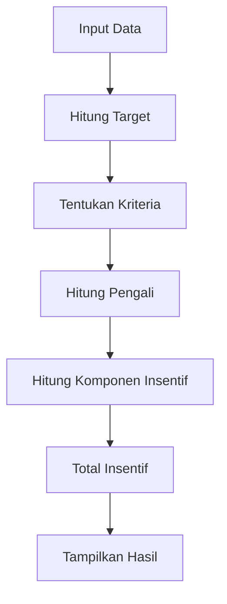

# Penjelasan Fungsi `calculate_incentive()`

Mari kita bahas fungsi ini seperti proses menghitung gaji bonus sales di bank:

## 1. Persiapan Perhitungan (Baris 331-339)
```python
def calculate_incentive():
    try:
        st.session_state.form_submitted = True
```
**Analogi**: Seperti mengambil kertas kosong dan menulis "MULAI PERHITUNGAN" di atasnya.

## 2. Pengambilan Data (Baris 340-383)
```python
# Mengambil data dari formulir
grading = st.session_state.get('grading', '')
bade_kur = float(st.session_state.get('bade_kur', 0))
# ... dan seterusnya
```
**Analogi**: Seperti mengumpulkan semua bukti transaksi dan laporan kinerja sales:
- Data Dasar: Seperti KTP dan jabatan
- Data Baki Debet: Seperti catatan hutang nasabah
- Data Transaksi: Seperti catatan aktivitas nasabah
- Data Booking: Seperti catatan penjualan baru
- Data Agen: Seperti laporan kinerja agen

## 3. Perhitungan Dasar (Baris 384-402)
```python
# Perhitungan blend dan target
bade_blend = bade_kur + bade_kum
target_grading_map = {...}
```
**Analogi**: Seperti menghitung total penjualan dan membandingkan dengan target:
- Trainee: Target 1 juta
- Junior: Target 2 miliar
- Senior: Target 4 miliar
- Executive: Target 10 miliar

## 4. Penentuan Kriteria (Baris 403-432)
```python
kriteria_penentu = (...)
parameter_pengali_map = {...}
```
**Analogi**: Seperti sistem penilaian dengan bintang:
- ⭐⭐⭐ = Pengali maksimal
- ⭐⭐ = Pengali sedang
- ⭐ = Pengali minimal

## 5. Perhitungan Insentif (Baris 433-526)

### a. Insentif Booking (Baris 433-455)
```python
nett_booking_blend = nett_booking_kur + nett_booking_kum
```
**Analogi**: Seperti menghitung komisi dari total penjualan

### b. Insentif Mix (Baris 456-460)
```python
persentase_nett_booking_kum = ...
```
**Analogi**: Seperti bonus tambahan untuk keseimbangan produk

### c. Insentif Leads (Baris 461-479)
```python
pengali_main_leads = ...
```
**Analogi**: Seperti bonus untuk referral nasabah baru

### d. Insentif LVM & Agen (Baris 480-499)
```python
boolean_agen = ...
pengali_main_lvm_agen = ...
```
**Analogi**: Seperti bonus untuk managemen tim

### e. Insentif AGF (Baris 500-503)
```python
persentase_agf_cukup_kol1 = ...
```
**Analogi**: Seperti bonus kelengkapan dokumen

## 🎨 Visualisasi Alur Perhitungan


## 💡 Contoh Perhitungan
```
Input:
- Grading: Senior
- Total Booking: 5 Miliar
- Target: 4 Miliar

Perhitungan:
1. Pencapaian = 125% ✅
2. Pengali = 1.5 (Senior + 3 kriteria)
3. Insentif = (5M/10M) × 10.000 × 1.5
```

## 🎯 Output
```
+------------------------+
|   HASIL PERHITUNGAN   |
+------------------------+
| NIP: 12345            |
| Nama: John Doe        |
| Total: Rp7.500.000    |
+------------------------+
```

Fungsi ini seperti "Akuntan Digital" yang menghitung semua komponen bonus dengan teliti! 💰🧮